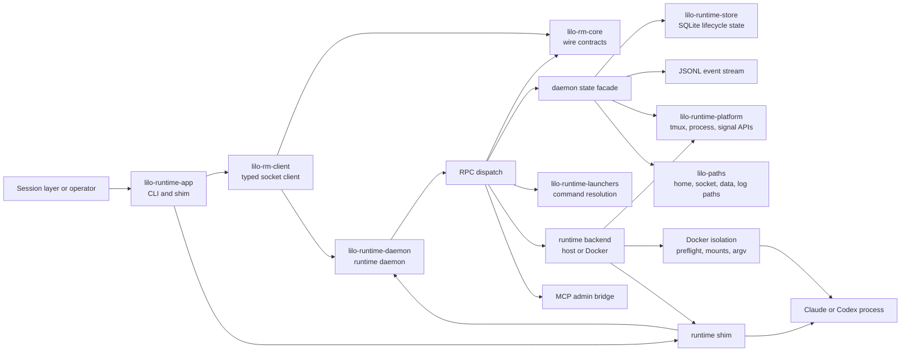

# Runtime Architecture

Runtime is the host execution substrate for littleorgans. It answers one
question for higher layers: what process was launched, what evidence proves it
is still alive, and what evidence proves it exited or was lost.

This document is the durable Phase 3 merge of the runtime source architecture
map and project intent. It uses monorepo crate names. The import provenance note
at the end records the historic source naming.

## Design Intent

Runtime is the kubelet shaped boundary in the v1 local control plane. Session
decides intent and user level records. Identity decides authorization and audit.
Runtime owns process launch, shim supervision, lifecycle evidence, Docker
isolation, platform interaction, and raw runtime status.

The v1 strategy remains local first: one operator, one host, one `lilod`
process after Phase 7 composition. The v2 strategy maps these substrate service
boundaries to Kubernetes services and CRD groups. The strategy note lives at
`/Users/alphab/Dev/LLM/DEV/helioy/littleorgans/littleorgans/NOTES/v1-v2-strategy.md`.

Runtime code should prefer observed evidence over inference. Runtime processes
can exit between polls, wedge, lose their wrapper process, or be killed outside
the normal API. The daemon records durable lifecycle state and cursor addressed
events so clients can reconcile without relying on stdout, pane state, or a
single in memory watcher.

## Contracts

`lilo-runtime-daemon` exposes the Phase 7 composition hook:
`RuntimeService::build(ctx) -> Result<Self>`. `RuntimeServiceContext` wraps
`DaemonConfig`, validates the daemon socket path during build, and `run()`
delegates to the existing daemon loop. This keeps Phase 3 as a lift of the
runtime daemon while giving `lilod` a stable factory API later.

`lilo-rm-core` owns the public JSON line protocol. `RuntimeRpc` carries spawn,
target validation, kill, pid kill, nudge, capture, status, version, watcher,
doctor, events, stop, MCP bridge, and shim messages. `RuntimeResponse` returns
typed payloads for successful operations, spawn conflicts, cursor expiration,
MCP bridge responses, daemon acknowledgements, and protocol errors.

The shim socket protocol is part of the same wire contract. A launched shim
requests its pending launch spec with `RuntimeRpc::ShimLaunch`, reports child
process identity with `RuntimeRpc::ShimReady`, and reports final child exit with
`RuntimeRpc::ShimExit`. The daemon trusts shim ready and shim exit as lifecycle
evidence.

`SpawnRequest` is the main control type. It carries session id, runtime kind,
target, cwd, environment, mounts, isolation policy, optional image, force
behavior, and shell resume data. `Lifecycle`, `RuntimeEvent`, `EventCursor`,
`StatusFilter`, `MountSpec`, `RuntimeLauncher`, and `LaunchSpec` are shared
across the client, daemon, launchers, store, app, and platform crates.

## Architecture Diagram



## System Shape

Phase 3 keeps the runtime daemon as a separate process. Phase 6 folds the user
verb tree into the unified `lilo` command surface. Phase 7 composes runtime
behind `lilod` through `RuntimeService::build`.

The runtime app crate contains the diagnostic command surface and the shim
entrypoint. Normal callers should use `lilo-rm-client`, which handles Unix
socket connection, framing, typed request helpers, and event watching. The
daemon handles socket accept, request dispatch, lifecycle coordination, event
append, Docker wrapping, reconciliation, and doctor data.

Runtime state has two records in Phase 3. `lilo-runtime-store` owns lifecycle
rows in SQLite. The daemon owns the JSONL event stream and cursor reads. Phase
7 moves the broader monorepo to one shared `LiloDb` pool, but Phase 3 keeps the
runtime store on its imported pool boundary.

Host execution is the default backend. Docker isolation is selected per spawn.
Runtime kind does not change when isolation changes. Launchers choose the
runtime command. The backend chooses where that command runs.

## Stable Flows

Session spawn flows from the caller into a `SpawnRequest`, through
`RuntimeRpc::Spawn`, preflight validation, launcher dispatch, backend launch
preparation, and daemon `begin_spawn`. The backend launches the shim, the shim
requests its launch spec, starts the runtime process, reports ready, and later
reports exit. The client receives `RuntimeResponse::Spawned` only after the
running lifecycle record and event are stored.

Kill flows through `RuntimeRpc::Kill` for a session id, or through
`RuntimeRpc::KillByPid` for the explicit admin escape hatch. The daemon sends
the requested signal, waits through the configured grace window, escalates when
needed, and records the resulting lifecycle evidence.

Status queries flow through `RuntimeRpc::Status` with `StatusFilter`. Status is
the authoritative reconciliation view when an event cursor has expired or a
client needs current lifecycle rows instead of an incremental stream.

Event queries flow through `RuntimeRpc::Events`. Events are appended in
observation order. Clients pass the last `EventCursor` they saw and receive the
next batch plus the new cursor. When a cursor falls behind the retained floor,
the daemon returns `CursorExpired { oldest }`, and the client reconciles with
status before resuming.

Reconciliation runs during daemon startup and periodically after startup. It
turns previously running lifecycle rows into current truth by checking process,
shim, tmux, and Docker evidence.

## Crate Map

| Crate | Role |
| --- | --- |
| `lilo-rm-core` | Published runtime protocol crate. Owns RPC, response, lifecycle, spawn, launcher, admin, MCP, output, and tool contract types. |
| `lilo-rm-client` | Published async client for the runtime daemon JSON line protocol and event watcher API. |
| `lilo-paths` | Published path policy crate. Owns littleorgans home, socket, data, log, cache, tmp, and runtime import path helpers until the Phase 5 cutover completes. |
| `lilo-runtime-app` | Internal diagnostic app and shim entrypoint. Phase 6 absorbs the user verb surface into `lilo`. |
| `lilo-runtime-daemon` | Internal daemon service. Owns request dispatch, lifecycle orchestration, event delivery, Docker wrapping, reconciliation, and `RuntimeService`. |
| `lilo-runtime-launchers` | Internal launcher registry for runtime command resolution. |
| `lilo-runtime-platform` | Internal host platform layer for tmux, signals, process status, and watcher support. |
| `lilo-runtime-store` | Internal SQLite lifecycle store, migrations, lifecycle reads, lifecycle writes, and migration metadata. |

## Task Routing

| Change | Primary home | Expected follow through |
| --- | --- | --- |
| Wire protocol, lifecycle vocabulary, spawn shape, event cursor shape | `lilo-rm-core` | Update client helpers, daemon dispatch, store codec, CLI output, snapshots, and public docs. |
| Runtime daemon lifecycle, reconciliation, doctor, or event delivery | `lilo-runtime-daemon` | Update integration tests and any status or event assertions in `lilo-runtime-app`. |
| Runtime command construction | `lilo-runtime-launchers` | Update daemon preflight and launch tests when request semantics change. |
| tmux, process, signal, or watcher behavior | `lilo-runtime-platform` | Update daemon lifecycle and status coverage. |
| Lifecycle persistence or migrations | `lilo-runtime-store` | Update daemon state code and migration assertions. |
| User command, shim command, generated MCP, or generated help surface | `lilo-runtime-app` | Edit authored tool contract data first when generation owns the output. |
| Path policy or home layout | `lilo-paths` | Check every daemon config, client endpoint, and store path consumer. |
| Public client ergonomics | `lilo-rm-client` | Keep the raw `RuntimeRpc` escape hatch and typed helpers aligned. |

## fmm Workflow

Use fmm for current structure instead of copying point in time file inventories
into this document. Regenerate the monorepo index after file moves, workspace
manifest changes, generated surface refreshes, or structural review:

```bash
fmm generate && fmm validate
```

Useful structural queries include:

```bash
fmm ls --group-by subdir
fmm lookup RuntimeService
fmm lookup RuntimeRpc
fmm glossary RuntimeClient
```

When fmm answers and authored files disagree, trust the authored source and
refresh fmm before making a structural claim.

## Provenance

This document distills `runtime-matters/MAP.md` and
`runtime-matters/PROJECT.md` from frozen runtime SHA
`dad5f09c058ef2269de86b7925540b7a3d11bf9c`. The imported source used historic
`rtm-*` crate directory names, but the architecture above uses the Phase 3
monorepo crate names.
