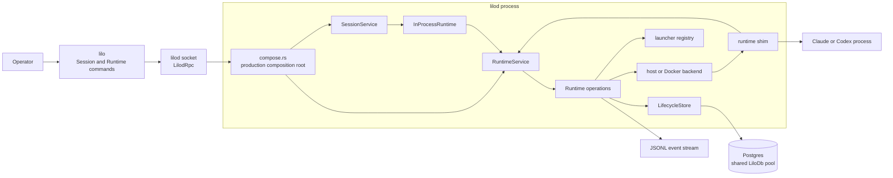

# Runtime architecture

Runtime is the host execution substrate for littleorgans. It answers one
question for higher layers: what process was launched, what evidence proves it
is still alive, and what evidence proves it exited or was lost.

This document describes the current Runtime architecture. The provenance note
at the end records the source import and its historic names.

## Design intent

Runtime is the kubelet shaped boundary in the v1 local control plane. Session
decides intent and user level records. Identity decides authorization and audit.
Runtime owns process launch, shim supervision, lifecycle evidence, Docker
isolation, platform interaction, and raw runtime status.

The v1 system has one operator, one host, and one composed `lilod` process. The
v2 strategy maps these bounded contexts to Kubernetes services and CRD groups.
The strategy note lives at
`/Users/alphab/Dev/LLM/DEV/helioy/littleorgans/littleorgans/NOTES/v1-v2-strategy.md`.

Runtime code should prefer observed evidence over inference. Runtime processes
can exit between polls, wedge, lose their wrapper process, or be killed outside
the normal API. The daemon records durable lifecycle state and cursor addressed
events so clients can reconcile without relying on stdout, pane state, or a
single in memory watcher.

The current implementation receives session backed launch requests directly
from Session. The target architecture routes placement through Schedule.
Schedule decides where an occupant runs; Runtime executes topology and process
operations. Runtime will execute the occupant launch spec. The [canonical
launch attachment contract](system.md#launch-attachment-contract) defines how
Runtime handles its optional attachment.

See [system architecture](system.md),
[Schedule architecture](schedule.md), and
[Transport architecture](transport.md) for the target boundary.

## Contracts

`internal/session/app/src/compose.rs` is the production composition root. It
opens one `LiloDb`, builds `RuntimeService`, passes that service into
`SessionService`, and serves both contexts through one `LilodRpc` socket.

`RuntimeServiceContext` carries `DaemonConfig` and the shared `LiloDb`.
`RuntimeService::build` creates the host executor, lifecycle store, event log,
and reconciliation tasks. Session calls the service through
`InProcessRuntime`. Raw diagnostic Runtime requests dispatch from
`LilodRpc::Runtime` to the same service.

`RtmdDriver` implements `RuntimePort` by sending `RuntimeRpc` inside
`LilodRpc::Runtime` over a socket. It preserves socket and conformance coverage
for the boundary. Production Session traffic uses `InProcessRuntime`.

`lilo-rm-core` owns the public JSON line protocol. `RuntimeRpc` carries spawn,
target validation, kill, pid kill, nudge, capture, status, version, watcher,
doctor, events, stop, MCP bridge, and shim messages. `RuntimeResponse` returns
typed payloads for successful operations, spawn conflicts, cursor expiration,
MCP bridge responses, daemon acknowledgements, and protocol errors.

The shim socket protocol is part of the same wire contract. A launched shim
requests its pending launch spec with `RuntimeRpc::ShimLaunch`, reports child
process identity with `RuntimeRpc::ShimReady`, and reports final child exit with
`RuntimeRpc::ShimExit`. The daemon trusts shim ready and shim exit as lifecycle
evidence.

`SpawnRequest` is the main control type. It carries session id, runtime kind,
target, cwd, environment, mounts, isolation policy, optional image, force
behavior, and shell resume data. `Lifecycle`, `RuntimeEvent`, `EventCursor`,
`StatusFilter`, `MountSpec`, `RuntimeLauncher`, and `LaunchSpec` are shared
across the client, daemon, launchers, store, app, and platform crates.

After Issue 41, Runtime `SpawnRequest` will also carry the optional
`launch_attachment`. Runtime will deserialize and retain the outer typed object
through receipt at `RuntimeService::spawn`. Only Transport will interpret its
fields. Runtime will apply the concrete process fields without copying the
attachment into `LaunchSpec`, the shim, or the child process.

## Architecture diagram


```mermaid
flowchart LR
    User["Operator"]
    App["lilo<br/>Session and Runtime commands"]
    Socket["lilod socket<br/>LilodRpc"]
    Database[("Postgres<br/>shared LiloDb pool")]
    Events["JSONL event stream"]
    Agent["Claude or Codex process"]

    subgraph Lilod["lilod process"]
        Compose["compose.rs<br/>production composition root"]
        Session["SessionService"]
        Driver["InProcessRuntime"]
        Runtime["RuntimeService"]
        Handler["Runtime operations"]
        Store["LifecycleStore"]
        Launchers["launcher registry"]
        Backend["host or Docker backend"]
        Shim["runtime shim"]
    end

    User --> App
    App --> Socket
    Socket --> Compose
    Compose --> Session
    Compose --> Runtime
    Session --> Driver
    Driver --> Runtime
    Runtime --> Handler
    Handler --> Store
    Handler --> Launchers
    Handler --> Backend
    Store --> Database
    Handler --> Events
    Backend --> Shim
    Shim --> Agent
    Shim --> Runtime
```

## System shape

`lilod` is the only production daemon process. `compose.rs` owns its socket,
shared database handle, Runtime service, Session service, and shutdown order.
The socket accepts both Session and diagnostic Runtime requests. Runtime does
not run a second production listener.

The Runtime app package contains the diagnostic command implementation and the
shim entrypoint. `lilo-rm-client` handles socket connection, framing, typed
request helpers, and event watching for diagnostic Runtime calls. The composed
listener dispatches those calls to `RuntimeService`.

Runtime state has two durable forms. `lilo-runtime-store` owns lifecycle rows in
Postgres through the `LiloDb` pool shared with Session. `RuntimeService` owns the
JSONL event stream and cursor reads. `compose.rs` closes the shared pool after
both services stop.

Host execution is the default backend. Docker isolation is selected per spawn.
Runtime kind does not change when isolation changes. Launchers choose the
runtime command. The backend chooses where that command runs.

## Stable flows

Session backed spawn enters `RuntimeService` through `InProcessRuntime`. Runtime
performs preflight validation, launcher dispatch, backend preparation, and
`begin_spawn`. The backend launches the shim. The shim requests its launch spec,
starts the agent process, reports ready, and later reports exit.

Session wraps the Runtime side effect in two Postgres transactions.
Transaction A records the pending Session intent and Runtime `Forking`
lifecycle. Runtime then returns a `Running` lifecycle.
Transaction B inserts the `Running` Session row, persists the returned Runtime
lifecycle, and resolves the intent.
Session appends the Runtime `Running` event only after Transaction B commits.

Raw `lilo runtime spawn` uses `RuntimeRpc::Spawn` through the composed socket.
It writes Runtime lifecycle and event evidence, but it creates no Session row or
Session spawn intent. After Issue 41, that diagnostic path will also keep
`launch_attachment` absent.

After Schedule activates, the same Runtime path receives the execution request
from Schedule. Runtime does not select the pane, interpret the occupant, or
prepare Transport capture. Raw diagnostic spawn remains a direct Runtime
surface and creates no Session or Schedule record.

Kill flows through `RuntimeRpc::Kill` for a session id, or through
`RuntimeRpc::KillByPid` for the explicit admin escape hatch. The daemon sends
the requested signal, waits through the configured grace window, escalates when
needed, and records the resulting lifecycle evidence.

Status queries flow through `RuntimeRpc::Status` with `StatusFilter`. Status is
the authoritative reconciliation view when an event cursor has expired or a
client needs current lifecycle rows instead of an incremental stream.

Event queries flow through `RuntimeRpc::Events`. Events are appended in
observation order. Clients pass the last `EventCursor` they saw and receive the
next batch plus the new cursor. When a cursor falls behind the retained floor,
the daemon returns `CursorExpired { oldest }`, and the client reconciles with
status before resuming.

Reconciliation runs during daemon startup and periodically after startup. It
turns previously running lifecycle rows into current truth by checking process,
shim, tmux, and Docker evidence.

## Crate map

| Crate | Role |
| --- | --- |
| `lilo-rm-core` | Published runtime protocol crate. Owns RPC, response, lifecycle, spawn, launcher, admin, MCP, output, and tool contract types. |
| `lilo-rm-client` | Published async client for Runtime JSON line requests inside the composed `LilodRpc` envelope and for the event watcher API. |
| `lilo-paths` | Published path policy crate. Owns the littleorgans home, socket, run, event, log, cache, and temporary paths. |
| `lilo-runtime-app` | Internal diagnostic command implementation and shim entrypoint used by `lilo`. |
| `lilo-runtime-daemon` | Internal Runtime service package. Owns request dispatch, lifecycle orchestration, event delivery, Docker wrapping, reconciliation, and `RuntimeService`. |
| `lilo-runtime-launchers` | Internal launcher registry for runtime command resolution. |
| `lilo-sys` | OS platform primitives for process status, signals, and exit watcher support on Unix (Linux and macOS). tmux behavior and `RuntimeSignal`/`KillOutcome` mapping stay daemon-internal. |
| `lilo-runtime-store` | Internal Postgres lifecycle store, migrations, lifecycle reads, lifecycle writes, and migration metadata. |

## Task routing

| Change | Primary home | Expected follow through |
| --- | --- | --- |
| Wire protocol, lifecycle vocabulary, spawn shape, event cursor shape | `lilo-rm-core` | Update client helpers, daemon dispatch, store codec, CLI output, snapshots, and public docs. |
| Runtime daemon lifecycle, reconciliation, doctor, or event delivery | `lilo-runtime-daemon` | Update integration tests and any status or event assertions in `lilo-runtime-app`. |
| Runtime command construction | `lilo-runtime-launchers` | Update daemon preflight and launch tests when request semantics change. |
| Process, signal, or watcher primitive behavior | `lilo-sys` | Update runtime daemon call sites and PAL tests. |
| tmux behavior or runtime signal mapping | `lilo-runtime-daemon` | Update daemon lifecycle, status, capture, nudge, and kill coverage. |
| Lifecycle persistence or migrations | `lilo-runtime-store` | Update daemon state code and migration assertions. |
| User command, shim command, generated MCP, or generated help surface | `lilo-runtime-app` | Edit authored tool contract data first when generation owns the output. |
| Path policy or home layout | `lilo-paths` | Check every daemon config, client endpoint, and store path consumer. |
| Public client ergonomics | `lilo-rm-client` | Keep the raw `RuntimeRpc` escape hatch and typed helpers aligned. |

## fmm workflow

Use fmm for current structure instead of copying point in time file inventories
into this document. Regenerate the monorepo index after file moves, workspace
manifest changes, generated surface refreshes, or structural review:

```bash
fmm generate && fmm validate
```

Useful structural queries include:

```bash
fmm ls --group-by subdir
fmm lookup RuntimeService
fmm lookup RuntimeRpc
fmm glossary RuntimeClient
```

When fmm answers and authored files disagree, trust the authored source and
refresh fmm before making a structural claim.

## Provenance

This document distills `runtime-matters/MAP.md` and
`runtime-matters/PROJECT.md` from frozen runtime SHA
`dad5f09c058ef2269de86b7925540b7a3d11bf9c`. The imported source used historic
`rtm-*` crate directory names, but the architecture above uses the Phase 3
monorepo crate names.
