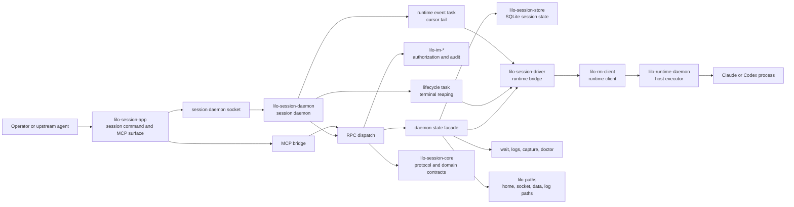

# Session Architecture

Session is the user level control plane for littleorgans. It turns operator
intent into durable session records, mailbox state, namespace context, labels,
polish commands, and runtime spawn requests.

This document is the durable Phase 4 merge of the session source architecture
map and project intent. It uses monorepo crate names. The import provenance
note at the end records the historic source naming.

## Design Intent

Session is the API server and etcd shaped boundary in the v1 local control
plane. Operators speak through kubectl shaped verbs. Session records are first
class daemon records. Runtime owns process launch and raw lifecycle evidence.
Identity owns authorization and audit. Session owns the user verbs that compose
those substrates into useful work.

The v1 strategy remains local first: one operator, one host, and one `lilod`
process after Phase 7 composition. The v2 strategy maps the same substrate
service boundaries to Kubernetes services and CRD groups. The strategy note
lives at
`/Users/alphab/Dev/LLM/DEV/helioy/littleorgans/littleorgans/NOTES/v1-v2-strategy.md`.

`lilo create session` is the declarative path for headless session creation.
`lilo run` is the imperative create and bind path for a target such as a tmux
pane. Force only preempts an occupied tmux pane. Labels are metadata on
sessions, not a standalone resource family.

Unmanaged session adoption is deferred until there is a coherent reconcile
model, such as import, adopt, or scheduler owned binding. The v1 session
contract does not guess ownership for processes it did not create.

## Contracts

`lilo-session-daemon` exposes the Phase 7 composition hook:
`SessionService::build(ctx) -> Result<Self>`. `SessionServiceContext` wraps the
session path policy input consumed by the imported daemon loop, validates it
during build, and `run()` delegates to the existing daemon. This keeps Phase 4
as a lift of the session daemon while giving `lilod` a stable factory API
later.

`lilo-session-core` owns the internal session protocol, domain types, selector
grammar, mail vocabulary, label mutations, namespace records, runtime mirrors,
tool contracts, and MCP JSON RPC envelope. `RpcRequest` and `RpcResponse` are
tagged JSON over the session daemon socket. `SpawnRequest` carries runtime,
role, workspace, directory, namespace, target, agent config, isolation, image,
environment, mounts, shell resume data, labels, and force behavior.

Session state is explicit: `Spawning`, `Running`, `Terminated`, or `Lost`.
Session rows carry the runtime link, transcript path, optional tmux pane,
optional agent config, timestamps, labels, and lost evidence. Session IDs are
minted before the runtime process exists so they can join session, runtime,
identity, and mailbox evidence.

Selectors match sessions by id, role, namespace, directory, label, or composed
terms. Selector matching is separate from namespace scoping. A namespace selector
matches data. A namespace scope constrains resolution. The all namespaces scope
removes that constraint for commands that are allowed to search across
namespaces.

Mail is durable session to session state. Nudge is ephemeral delivery through
the runtime driver. The two share command and MCP routing, but they do not share
persistence semantics.

## Architecture Diagram



## System Shape

Phase 4 keeps the session daemon as a separate imported process. Phase 6 folds
the user verb tree into the unified `lilo` command surface. Phase 7 composes
session behind `lilod` through `SessionService::build`.

The session app crate owns the command parser, command dispatch, embedded MCP
transport, generated help text, generated MCP schema, and generated MCP
instructions. Authored tool contracts live in `lilo-session-core`; generated
session app surfaces follow those contracts.

The daemon accepts socket requests, extracts peer credentials, builds a request
context, authorizes through identity, dispatches typed RPC requests, persists
session state, drives runtime through `lilo-session-driver`, tails runtime
events, reconciles lifecycle evidence, and returns typed protocol responses.
The daemon invariant is: authorize, persist intent, drive runtime, persist
evidence, respond.

`lilo-session-store` owns SQLite persistence during Phase 4. Phase 7 moves
session store access to the shared `LiloDb` pool, but Phase 4 keeps the imported
rusqlite boundary. The durable table family uses session scoped names such as
`session_sessions`, `session_namespaces`, and `session_mail` when it joins the
shared database contract.

Path policy lives in `lilo-paths`. It carries the current session path adapter
and the monorepo `~/.lilo/` policy while Phase 5 finishes the cutover.

## Stable Flows

Session creation resolves namespace and directory context, builds a
`SpawnRequest`, sends `RpcRequest::Spawn`, authorizes the principal, inserts a
spawning session row, calls the runtime driver, stores running evidence, and
returns `RpcResponse::Spawned` with the hydrated session.

Delete resolves the requested selector under its namespace scope, authorizes
the principal against each matched session, asks the runtime driver to terminate
running work, updates persisted state, and returns a per session result. A
namespace delete cascades to its sessions and clears user context when that
context points at the deleted namespace.

Mail send inserts durable rows for recipients. Mail read marks rows read.
Mail check reports unread counts without consuming content. Stop check clears
active waiting state for a mailbox style workflow.

Nudge resolves a target session or scope, authorizes the principal, and asks
the runtime driver to deliver the content to the live target. It is not durable
mail.

Labels are mutations on session records. There is no standalone label CRUD
surface. Reads expose labels on sessions, and selector grammar can target
`label:key=value`.

Selector consuming batch mutations use positional selectors. Single session
commands use positional session ids. List and read commands use an explicit
selector option. The namespace scope option and the all namespaces option
control where the selector resolves.

Capture, logs, wait, and doctor are daemon mediated polish surfaces. They read
stored session context, runtime evidence, and driver data without bypassing the
authorization path.

Reconciliation runs at daemon startup and while the daemon is alive. Startup
reconciliation turns stale running rows into current truth by probing runtime
lifecycle evidence. The runtime event task advances a stored event cursor and
reconciles from status when a cursor expires. The lifecycle task persists
terminal exits that were observed outside the incremental event stream.

MCP exposure flows through the same core contracts as the CLI. The embedded
server forwards MCP shaped JSON RPC to the daemon bridge. Tool handlers map MCP
tool names onto the same `RpcRequest` variants used by commands.

## Crate Map

| Crate | Role |
| --- | --- |
| `lilo-session-app` | Internal session command and MCP surface. Owns command dispatch, generated help, generated schema, embedded MCP transport, and imported diagnostic binary behavior until Phase 6. |
| `lilo-session-core` | Internal contract crate. Owns RPC, responses, spawn shape, sessions, selectors, labels, namespaces, mail, runtime mirrors, MCP envelope, and authored tool contracts. |
| `lilo-session-daemon` | Internal daemon service. Owns socket serving, request dispatch, authorization, lifecycle tasks, runtime event tailing, reconciliation, MCP bridge, polish commands, and `SessionService`. |
| `lilo-session-driver` | Internal runtime bridge. Owns the spawn driver trait, runtime client adapter, capture, nudge, termination, terminal reaping, and runtime to session conversions. |
| `lilo-session-store` | Internal SQLite store. Owns session, namespace, mail, label, runtime event cursor, migration, and timestamp persistence during Phase 4. |
| `lilo-paths` | Published path policy crate. Owns littleorgans home, socket, data, log, cache, tmp, and session import path helpers until the Phase 5 cutover completes. |

## Task Routing

| Change | Primary home | Expected follow through |
| --- | --- | --- |
| RPC wire shape, response shape, spawn vocabulary, session lifecycle, selector grammar, label grammar, namespace contract, or mail vocabulary | `lilo-session-core` | Update daemon dispatch, store codecs, app command output, generated surfaces, snapshots, and docs. |
| Daemon request handling, authorization, lifecycle tasks, event tailing, reconciliation, wait, logs, capture, doctor, or MCP bridge behavior | `lilo-session-daemon` | Update daemon integration tests and app protocol coverage. |
| Session, namespace, mail, label, event cursor, or migration persistence | `lilo-session-store` | Update daemon state code, migration assertions, and selector matching coverage. |
| Runtime spawn conversion, capture, nudge, termination, terminal reaping, or runtime conflict formatting | `lilo-session-driver` | Update driver tests and daemon runtime bridge tests. |
| User command behavior, embedded MCP transport, generated help, generated schema, or command output | `lilo-session-app` | Edit authored tool contract data first when generation owns the output. |
| Path policy, home layout, socket layout, or cutover behavior | `lilo-paths` | Check every app, daemon, store, client endpoint, and test fixture consumer. |
| Identity authorization resource shape | `lilo-session-daemon` | Keep identity service contracts, audit expectations, and peer credential extraction aligned. |

## fmm Workflow

Use fmm for current structure instead of copying snapshot file inventories into
this document. Regenerate the monorepo index after file moves, workspace
manifest changes, generated surface refreshes, or structural review:

```bash
fmm generate && fmm validate
```

Useful structural queries include:

```bash
fmm list-files --group-by=subdir
fmm lookup SessionService
fmm lookup RpcRequest
fmm glossary Selector
```

The MCP equivalents are useful when working inside an agent context, such as
`fmm_list_files(group_by: "subdir")`, `fmm_lookup_export(name:
"SessionService")`, and `fmm_glossary(pattern: "RpcRequest")`.

When fmm answers and authored files disagree, trust the authored source and
refresh fmm before making a structural claim.

## Provenance

This document distills `session-matters/MAP.md` and
`session-matters/PROJECT.md` from the Phase 4 source import. The imported
source used historic `sm-core`, `sm-store`, `sm-driver`, `sm-daemon`, `sm-cli`,
and historic `sm-paths` crate directory names, but the architecture above uses
the Phase 4 monorepo crate names.
