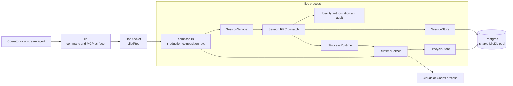

# Session architecture

Session is the user level control plane for littleorgans. It turns operator
intent into durable session records, mailbox state, namespace context, labels,
polish commands, and runtime spawn requests.

This document describes the current Session architecture. The provenance note
at the end records the source import and its historic names.

## Design intent

Session is the API server and etcd shaped boundary in the v1 local control
plane. Operators speak through kubectl shaped verbs. Session records are first
class daemon records. Runtime owns process launch and raw lifecycle evidence.
Identity owns authorization and audit. Session owns the user verbs that compose
those substrates into useful work.

The v1 system has one operator, one host, and one composed `lilod` process. The
v2 strategy maps the same bounded contexts to Kubernetes services and CRD
groups. The strategy note lives at
`/Users/alphab/Dev/LLM/DEV/helioy/littleorgans/littleorgans/NOTES/v1-v2-strategy.md`.

`lilo create session` is the declarative path for headless session creation.
`lilo run` is the imperative create and bind path for a target such as a tmux
pane. Force only preempts an occupied tmux pane. Labels are metadata on
sessions, not a standalone resource family.

Unmanaged session adoption is deferred until there is a coherent reconcile
model, such as import, adopt, or scheduler owned binding. The v1 session
contract does not guess ownership for processes it did not create.

The current implementation drives Runtime directly. The target architecture
inserts Schedule as the sole placement authority. Session prepares logical
intent and the occupant launch spec, then Schedule places the occupant and asks
Runtime to execute it. After Session mints `SessionId` and Identity authorizes
the operation, Session will ask Transport to prepare capture. Session will add
the returned attachment to `SpawnLaunch`, then build the complete Runtime
request before Transaction A. Schedule will never interpret provider,
transcript, or attachment semantics.

See [system architecture](system.md),
[Schedule architecture](schedule.md), and
[Transport architecture](transport.md) for the target boundary.

## Contracts

`internal/session/app/src/compose.rs` is the production composition root. It
opens one `LiloDb`, builds `RuntimeService`, passes that service into
`SessionService::build`, and serves both contexts through one `LilodRpc` socket.

`SessionServiceContext` carries the path policy, daemon version, shared
`LiloDb`, and composed `RuntimeService`. `SessionService::build` creates the
Session store, Identity client, lifecycle tasks, event task, and
`InProcessRuntime`. Session calls Runtime through that in process adapter.
`RtmdDriver` implements the same `RuntimePort` over the socket protocol for
contract and conformance tests. Production Session traffic does not use it.

`lilo-session-core` owns the internal session protocol, domain types, selector
grammar, mail vocabulary, label mutations, namespace records, runtime mirrors,
tool contracts, and MCP JSON RPC envelope. `SessionRpc` and `RpcResponse` are
tagged inside `LilodRpc::Session` on the composed socket. `SpawnRequest` carries runtime,
role, workspace, directory, namespace, target, agent config, isolation, image,
environment, mounts, shell resume data, labels, and force behavior.

Issue 41 will leave that external Session `SpawnRequest` unchanged. Session
will add the optional `launch_attachment` only to `SpawnLaunch` after minting
`SessionId`. Session will deserialize and copy the outer typed attachment, but
only Transport will interpret its fields. Session will persist the complete
Runtime request through the existing
`session_spawn_intents.spawn_request_json` field. The [canonical launch
attachment contract](system.md#launch-attachment-contract) defines the shared
rules.

Session state is explicit: `Spawning`, `Running`, `Terminated`, or `Lost`.
Session rows carry the runtime link, transcript path, optional tmux pane,
optional agent config, timestamps, labels, and lost evidence. Session IDs are
minted before the runtime process exists so they can join session, runtime,
identity, and mailbox evidence.

Selectors match sessions by id, role, namespace, directory, label, or composed
terms. Selector matching is separate from namespace scoping. A namespace selector
matches data. A namespace scope constrains resolution. The all namespaces scope
removes that constraint for commands that are allowed to search across
namespaces.

Mail is durable session to session state. Nudge is ephemeral delivery through
the runtime driver. The two share command and MCP routing, but they do not share
persistence semantics.

## Architecture diagram


```mermaid
flowchart LR
    User["Operator or upstream agent"]
    App["lilo<br/>command and MCP surface"]
    Socket["lilod socket<br/>LilodRpc"]
    Database[("Postgres<br/>shared LiloDb pool")]
    Agent["Claude or Codex process"]

    subgraph Lilod["lilod process"]
        Compose["compose.rs<br/>production composition root"]
        Session["SessionService"]
        Handler["Session RPC dispatch"]
        Store["SessionStore"]
        Identity["Identity authorization and audit"]
        Driver["InProcessRuntime"]
        Runtime["RuntimeService"]
        RuntimeStore["LifecycleStore"]
    end

    User --> App
    App --> Socket
    Socket --> Compose
    Compose --> Session
    Compose --> Runtime
    Session --> Handler
    Handler --> Identity
    Handler --> Store
    Handler --> Driver
    Driver --> Runtime
    Store --> Database
    RuntimeStore --> Database
    Runtime --> RuntimeStore
    Runtime --> Agent
```

## System shape

`lilod` is the only production daemon process. `compose.rs` owns its socket,
shared database handle, Session service, Runtime service, and shutdown order.
The socket accepts `LilodRpc::Session` and `LilodRpc::Runtime` requests. Session
requests dispatch to `SessionService`. Diagnostic Runtime requests dispatch to
the same `RuntimeService` that Session calls in process.

The session app crate owns the command parser, command dispatch, embedded MCP
transport, generated help text, generated MCP schema, and generated MCP
instructions. Authored tool contracts live in `lilo-session-core`; generated
session app surfaces follow those contracts.

The composed listener extracts peer credentials and dispatches typed requests.
Session authorizes through Identity, persists Session state, calls Runtime
through `lilo-session-driver`, tails Runtime events, reconciles lifecycle
evidence, and returns typed responses. The Session spawn invariant is:
authorize, persist intent, drive Runtime, persist evidence, then respond.

`lilo-session-store` owns Session persistence in Postgres. Session and Runtime
store handles share the `LiloDb` pool created by `compose.rs`. The Session table
family includes `session_sessions`, `session_spawn_intents`,
`session_namespaces`, and `session_labels`. The mail log uses `messages` and
`message_deliveries`.

Path policy lives in `lilo-paths`. It owns the `~/.lilo/` paths for config, run
files, events, logs, cache, and temporary files. Postgres configuration comes
from `LILO_DATABASE_URL` or `$LILO_HOME/settings.toml`.

## Stable flows

Session creation resolves namespace and directory context, then builds a
`SpawnRequest`. The handler mints the `SessionId` before Runtime work begins.

Transaction A records the authorization audit, the pending
`session_spawn_intents` row, and the Runtime `Forking` lifecycle. Session then
calls `InProcessRuntime::spawn`. Runtime starts the shim and returns a `Running`
lifecycle.

Transaction B inserts the `Running` Session row, persists the returned Runtime
`Running` lifecycle, and resolves the spawn intent. Session appends the Runtime
`Running` event only after Transaction B commits. A failed Runtime launch aborts
the intent and removes the `Forking` lifecycle. Startup reconciliation completes
or aborts any intent left pending across a process failure.

The target flow preserves the two transaction protocol but replaces the direct
runtime call. Session will mint `SessionId`, obtain authorization, prepare
Transport capture, attach the result to `SpawnLaunch`, and build the complete
Runtime request before Transaction A. The current path sends that request to
Runtime. The target path submits the occupant launch spec to Schedule. Raw
`lilo runtime spawn` will keep `launch_attachment` absent because it bypasses
Session. The direct path will be removed after Schedule acceptance rather than
retained in parallel.

Delete resolves the requested selector under its namespace scope, authorizes
the principal against each matched session, asks the runtime driver to terminate
running work, updates persisted state, and returns a per session result. A
namespace delete cascades to its sessions and clears user context when that
context points at the deleted namespace.

Mail send inserts durable rows for recipients. Mail read marks rows read.
Mail check reports unread counts without consuming content. Stop check clears
active waiting state for a mailbox style workflow.

Nudge resolves a target session or scope, authorizes the principal, and asks
the runtime driver to deliver the content to the live target. Nudge does not
create durable mail.

Labels are mutations on session records. There is no standalone label CRUD
surface. Reads expose labels on sessions, and selector grammar can target
`label:key=value`.

Selector consuming batch mutations use positional selectors. Single session
commands use positional session ids. List and read commands use an explicit
selector option. The namespace scope option and the all namespaces option
control where the selector resolves.

Capture, logs, wait, and doctor are daemon mediated polish surfaces. They read
stored session context, runtime evidence, and driver data without bypassing the
authorization path.

Reconciliation runs at daemon startup and while the daemon is alive. Startup
reconciliation turns stale running rows into current truth by probing runtime
lifecycle evidence. The runtime event task advances a stored event cursor and
reconciles from status when a cursor expires. The lifecycle task persists
terminal exits that were observed outside the incremental event stream.

MCP exposure flows through the same core contracts as the CLI. The embedded
server forwards MCP shaped JSON RPC to the daemon bridge. Tool handlers map MCP
tool names onto the same `RpcRequest` variants used by commands.

## Crate map

| Crate | Role |
| --- | --- |
| `lilo-session-app` | Internal Session command, MCP, and composition package. Owns command dispatch, generated help, generated schema, embedded MCP transport, and the production `lilod` composition root. |
| `lilo-session-core` | Internal contract crate. Owns RPC, responses, spawn shape, sessions, selectors, labels, namespaces, mail, runtime mirrors, MCP envelope, and authored tool contracts. |
| `lilo-session-daemon` | Internal Session service. Owns request dispatch, authorization, lifecycle tasks, runtime event tailing, reconciliation, MCP bridge, polish commands, and `SessionService`. |
| `lilo-session-driver` | Internal runtime bridge. Owns the spawn driver trait, runtime client adapter, capture, nudge, termination, terminal reaping, and runtime to session conversions. |
| `lilo-session-store` | Internal Postgres store. Owns session, namespace, mail, label, runtime event cursor, migration, and timestamp persistence. |
| `lilo-paths` | Published path policy crate. Owns the littleorgans home, socket, run, event, log, cache, and temporary paths. |

## Task routing

| Change | Primary home | Expected follow through |
| --- | --- | --- |
| RPC wire shape, response shape, spawn vocabulary, session lifecycle, selector grammar, label grammar, namespace contract, or mail vocabulary | `lilo-session-core` | Update daemon dispatch, store codecs, app command output, generated surfaces, snapshots, and docs. |
| Daemon request handling, authorization, lifecycle tasks, event tailing, reconciliation, wait, logs, capture, doctor, or MCP bridge behavior | `lilo-session-daemon` | Update daemon integration tests and app protocol coverage. |
| Session, namespace, mail, label, event cursor, or migration persistence | `lilo-session-store` | Update daemon state code, migration assertions, and selector matching coverage. |
| Runtime spawn conversion, capture, nudge, termination, terminal reaping, or runtime conflict formatting | `lilo-session-driver` | Update driver tests and daemon runtime bridge tests. |
| User command behavior, embedded MCP transport, generated help, generated schema, or command output | `lilo-session-app` | Edit authored tool contract data first when generation owns the output. |
| Path policy, home layout, socket layout, or cutover behavior | `lilo-paths` | Check every app, daemon, store, client endpoint, and test fixture consumer. |
| Identity authorization resource shape | `lilo-session-daemon` | Keep identity service contracts, audit expectations, and peer credential extraction aligned. |

## fmm workflow

Use fmm for current structure instead of copying snapshot file inventories into
this document. Regenerate the monorepo index after file moves, workspace
manifest changes, generated surface refreshes, or structural review:

```bash
fmm generate && fmm validate
```

Useful structural queries include:

```bash
fmm list-files --group-by=subdir
fmm lookup SessionService
fmm lookup RpcRequest
fmm glossary Selector
```

The MCP equivalents are useful when working inside an agent context, such as
`fmm_list_files(group_by: "subdir")`, `fmm_lookup_export(name:
"SessionService")`, and `fmm_glossary(pattern: "RpcRequest")`.

When fmm answers and authored files disagree, trust the authored source and
refresh fmm before making a structural claim.

## Provenance

This document distills `session-matters/MAP.md` and
`session-matters/PROJECT.md` from the Phase 4 source import. The imported
source used historic `sm-core`, `sm-store`, `sm-driver`, `sm-daemon`, `sm-cli`,
and historic `sm-paths` crate directory names, but the architecture above uses
the Phase 4 monorepo crate names.
