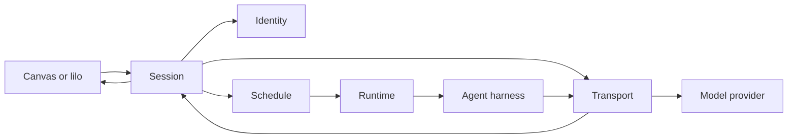

# System Architecture

**Status:** bounded design direction. Implemented and target behavior are
identified separately.

littleorgans is one local control plane with one operator, one host, and one
`lilod` process. Five bounded contexts contribute to the intended product:

| Context | Owns | Does not own |
| --- | --- | --- |
| Identity | authorization, audit, service identity, RBAC shape | session meaning, placement, process execution |
| Session | logical sessions, operator verbs, intent, mail, nudge, labels | topology, provider payloads, process internals |
| Schedule | placement, desired topology, stable occupant bindings, reconciliation | agent meaning, launch internals, provider traffic |
| Runtime | process launch, shim behavior, platform execution, lifecycle evidence | placement decisions, session meaning, payload policy |
| Transport | provider wire capture, payload interpretation, request transformation, fidelity evidence | authorization, placement, process selection |

Canvas is the human product surface. Desktop hosts Canvas. They are one
product boundary rather than separate bounded contexts.

## Current and Target State

The v0.8 implementation contains Identity, Session, and Runtime. Session calls
Runtime directly. Schedule is reserved and Transport has no monorepo
implementation yet.

The target placement flow inserts Schedule between Session and Runtime. The
current direct call is an interim implementation and must not become a second
permanent launch path.



The target dependency direction is:

```text
Canvas or lilo -> Session -> Schedule -> Runtime
                      |
                      +-> Transport -> provider

Identity authorizes Session, Schedule, Runtime, and Transport service actions.
```

Schedule receives an opaque launch payload. Session may attach a Transport
capture lease to that payload before asking Schedule to place the occupant.
Schedule records and forwards the payload without interpreting provider,
overlay, transcript, role, or harness semantics.

## Session Backed Launch

The target launch sequence is:

1. Session mints the typed `SessionId` and persists occupant intent.
2. Identity authorizes the requested operation.
3. Session asks Transport to prepare capture for the `SessionId`.
4. Transport returns an opaque capture lease and launch additions.
5. Session submits the occupant and opaque launch payload to Schedule.
6. Schedule selects or creates topology and records the stable binding.
7. Schedule asks Runtime to execute the launch at the selected target.
8. Runtime starts the shim and harness without interpreting capture policy.
9. Transport observes the provider wire and records the captured turn.
10. Session exposes the joined session and capture read model to Canvas.

Raw `lilo runtime spawn` remains diagnostic access. It creates no Session or
Schedule record. The first Transport and Canvas slice applies only to session
backed `lilo run`.

## Stable Identity

`SessionId` is the platform join key across Session, Runtime, Transport, and
Canvas. It is the runtime spawn id as well as the capture correlation id.

Schedule adds stable topology identities only when its context activates. A
durable occupant binding resolves through a Schedule owned pane identity and a
live tmux id. Positional addresses such as `session:window.pane` are display
data only.

Transport may add request and turn identifiers for captured records. Array
positions and message indexes identify fields only inside one held request.
They cannot become durable overlay identities.

## Reconciliation

Session owns logical desired state. Schedule reconciles declared placement and
the occupant's `Never`, `OnFailure`, or `Always` restart policy. Runtime
provides topology and lifecycle evidence and performs the native resume launch.

Transport remains outside placement reconciliation. A resumed harness keeps
the logical `SessionId`; Transport correlates the new traffic and preserves
provider continuation semantics.

## First Architecture Proof

The smallest coherent product proof is:

1. `lilo run claude` creates a session backed launch with capture required.
2. Transport captures and holds the first Claude Messages request.
3. Canvas renders a first turn report with raw and interpreted views.
4. The operator edits one tool description selected by tool name.
5. Transport applies the request scoped edit and records an audit result.
6. Transport validates and forwards a provider valid request.
7. The provider response reaches the harness normally.
8. Canvas shows original, forwarded, response, and audit evidence.

The current Session to Runtime route may implement this proof. Its capture
attachment must remain opaque so Schedule can later mediate the same launch
without changing Transport or Canvas.

## Explicit Deferrals

The first proof excludes registry, signing, entitlement, accounts, accepted
cache, cache arbitration, remote overlay distribution, distributed refresh,
overlay channels, reusable positional identities, multiuser operation,
separate Inspector product ownership, eval and compare, and historical indexing
beyond the capture records required by the proof.

## Product Decisions Still Open

Stuart retains authority over:

1. Claude only or both providers editable in the first slice.
2. Whether the first request waits for Canvas or capture is passive.
3. Exact request overlay lifetime or reuse across matching harness versions.
4. Failure behavior when capture cannot prepare or persist.
5. Automatic report opening or explicit navigation.
6. Curated first or raw first report hierarchy.
7. Redaction, secret handling, retention, and export policy.
8. Static HTML proof before Canvas integration or direct Canvas delivery.

## Related Documents

- [Session architecture](session.md)
- [Schedule architecture](schedule.md)
- [Runtime architecture](runtime.md)
- [Transport architecture](transport.md)
- [Canvas architecture](canvas.md)
